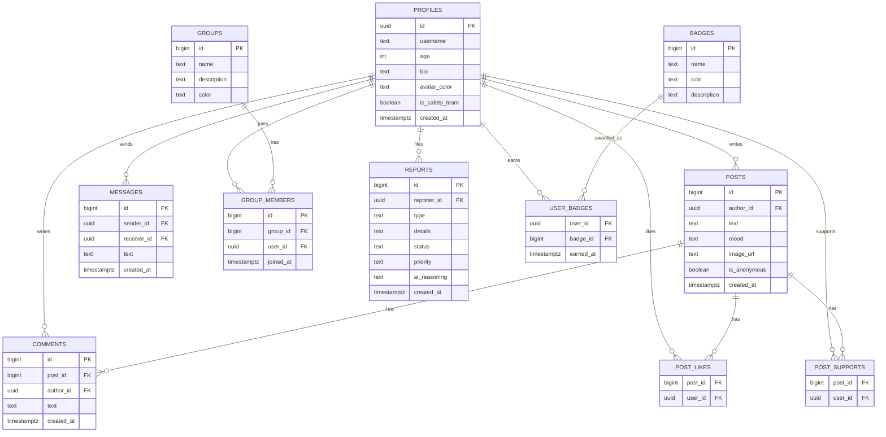

# Together — Data Model (ERD)

Database: **Supabase (Postgres)**. Full SQL is in [`supabase/schema.sql`](../supabase/schema.sql).

> If GitHub doesn't render the diagram above for any reason, the same structure
> is described table-by-table in `supabase/schema.sql` with full column types
> and foreign keys.

## Keys & relationships summary

| Table | Primary key | Foreign keys |
|---|---|---|
| `profiles` | `id` (= `auth.users.id`) | — |
| `posts` | `id` | `author_id` → `profiles.id` |
| `comments` | `id` | `post_id` → `posts.id`, `author_id` → `profiles.id` |
| `post_likes` | (`post_id`, `user_id`) | `post_id` → `posts.id`, `user_id` → `profiles.id` |
| `post_supports` | (`post_id`, `user_id`) | `post_id` → `posts.id`, `user_id` → `profiles.id` |
| `groups` | `id` | — |
| `group_members` | `id` | `group_id` → `groups.id`, `user_id` → `profiles.id` |
| `messages` | `id` | `sender_id` / `receiver_id` → `profiles.id` |
| `badges` | `id` | — |
| `user_badges` | (`user_id`, `badge_id`) | `user_id` → `profiles.id`, `badge_id` → `badges.id` |
| `reports` | `id` | `reporter_id` → `profiles.id` |

## External services & integrations

| Service | Type | What it's used for |
|---|---|---|
| **Google OAuth** (via Supabase Auth) | Authentication | Users sign in with their Google account — no passwords stored by Together. |
| **Anthropic Claude API** | AI / API call | Server-side only, inside the `triage-report` Supabase Edge Function. Classifies each incoming safety report's urgency (`low` / `medium` / `high` / `urgent`) so the safety team's queue is sorted by what needs attention first. Self-harm reports are always force-escalated to `urgent` regardless of the model's output. |
| **Supabase Edge Function** (`triage-report`) | Server logic | Receives the report from the client, calls the Anthropic API with the API key (kept in a server-side secret, never shipped to the browser), then writes the row to `reports` using the Supabase service role. |
| **Supabase Realtime** | Live data | Powers the chat screen — new messages appear instantly without polling. |
